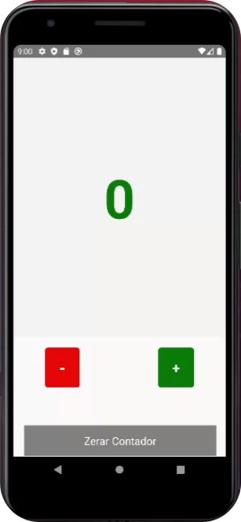

# contador - Reactve Native

### Contador para controle de público:

Desenvolvi em contador, baseado num app que vi num supermercado em minha cidade.
Um funcionário fazia o controle de pessoas dentro do estabelecimento para não
exceder o limite permitido, conforme regra de combate e prevenção ao conona virus.

